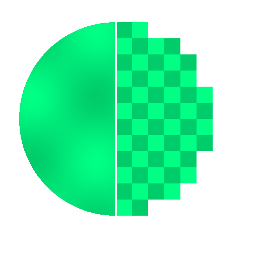

	

# ResolutionControl Reloaded

ResolutionControl Reloaded is a fork of [Resolution Control +](https://github.com/trisk/Resolution-Control), which is a fork of, [Resolution Control +](https://github.com/UltimateBoomer/Resolution-Control), which is a fork of, [Resolution Control](https://github.com/juliand665/Resolution-Control)

This mod has had a long history

### Resolution Scaling / Render Scale

Gain more FPS by chaning the resolution the actual game renders at. This is present in most modern games and is an option along the lines of, "RenderScale"

---

### Antialiasing (or not)

You can change the algorithims for down and upscaling to either linear or nearest neighbor. Nearest neighbor makes the game less "blurry" but it makes it more pixelated at lower resolutions and linear smooths out everything, but makes it "blurrier"

### Compatibility

Currently the mod supports Sodium/Iris. Immersive portals is borked along with Fabulous graphics.

### Better performance with and without Shaders

The main reason why I ported this mod is because of shaders, you can run shaders with more frames than before by downscaling and it allows me to run shaders on integrated graphics from the 7th gen. 

## How does it make the game look?

The difference between 0.75x and 1.0x is not really noticeable, but the performance gain can be huge, so even if you have a high end PC, consider giving this mod a shot to boost shader performance even more.

### Feel free to put this into modpacks

### I dont take full credit for this mod, I simply just ported it to newer versions